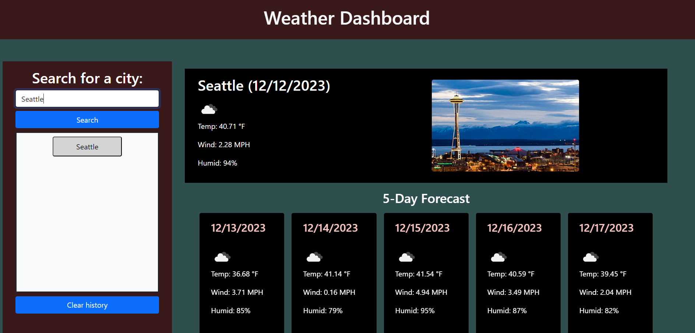

# Boudraa-Weather-Dashboard

## Description

This website functions as a weather dashboard. You can enter a location that you'd like to know the weather for, and its current weather conditions as well as a 5-day forecast will be displayed. The search history will also be saved, and the weather information for previously visited locations can be accessed again by clicking on it. There is also an image of the city that you looked up displayed to the right of the current weather.

Link to deployed webpage: https://adamboudruh.github.io/Boudraa-Weather-Dashboard/

